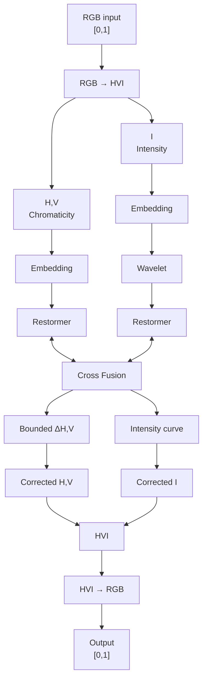

# LCWHVINet

> **Low-Light Image Enhancement with HVI, Wavelet and Restormer**

<p align="center">
  
  
  
  
  
</p>

## Overview

**LCWHVINet** is a low-light image restoration architecture designed to reduce luminance instability and, in particular, excessively saturated chromatic reconstructions.

Instead of performing an unconstrained RGB reconstruction, the network separates the problem into two components:

- **chromaticity**, represented by the H and V channels of HVI;
- **intensity**, represented by the I channel.

Wavelet information is used only in the intensity branch. Color and intensity are processed with Restormer-style blocks and interact through controlled residual fusion.

The complete pipeline operates on **RGB images normalized to `[0, 1]`**.

### Main design goals

- Prevent unconstrained independent RGB reconstruction.
- Explicitly separate illumination and chromatic correction.
- Allow an initial training stage with chromaticity completely locked.
- Mathematically bound the magnitude of chromatic correction.
- Preserve Wavelet as a frequency-information source without directly reconstructing RGB.
- Replace Swin spatial-window dependence with Restormer processing.
- Monitor PSNR, SSIM, LPIPS, intensity error, chromatic error and clipping.
- Use the same training/inference pipeline for **LSD/PAMAZONIA, LOL-v1 and LOL-v2**.

---

## Architecture



### Chromatic modes

| Mode | Behavior | Recommended use |
|---|---|---|
| `lock` | `HV_out = HV_input` | Initial stabilization phase |
| `bounded` | `HV_out = HV_input + ΔHV` | Controlled chromatic refinement |

For `bounded` mode:

```text
ΔHV = color_scale × tanh(raw_ΔHV)
```

Default value:

```text
color_scale = 0.03
```

The intensity branch uses a bounded differentiable curve. The curve head and chromatic-correction head are zero-initialized so that the architecture starts approximately as an identity transformation.

---

## Repository structure

```text
LCWNet/
├── models/
│   ├── __init__.py
│   ├── lcw_hvi_backbone.py
│   └── loss_hvi.py
│
├── dataload/
│   ├── __init__.py
│   └── llie_dataset.py
│
├── train_lcw_hvi.py
└── infer_lcw_hvi.py
```

Generated training artifacts should normally remain outside version control:

```text
ckpt/
results/
*.pth
*.pt
*.ckpt
*.out
*.err
```

---

## Requirements

Core dependencies:

- Python
- PyTorch
- Torchvision
- NumPy
- Pillow
- LPIPS — optional for inference/evaluation

Install LPIPS:

```bash
source /home/unicornio/User/.venv/bin/activate
python -m pip install lpips
```

Check PyTorch and CUDA visibility:

```bash
python -c "import torch; print(torch.__version__); print(torch.cuda.is_available())"
```

---

## Data conventions

### Normalization

```text
RGB float32 ∈ [0,1]
```

Do **not** convert the dataset to `[-1,1]`.

### Data augmentation

Only synchronized geometric augmentation is used between LOW and GT:

- horizontal flip;
- vertical flip;
- rotations of `0°`, `90°`, `180°` or `270°`;
- synchronized crop.

No `ColorJitter`, gamma modification or chromatic augmentation should be introduced.

---

## Supported datasets

The dataloader automatically selects the expected directory structure from `--dataset_name`.

| Dataset | `--dataset_name` | Train LOW | Train GT |
|---|---|---|---|
| LSD | `lsd` | `inputPatchDLL/` | `gtPatchDLL/` |
| PAMAZONIA | `pamazonia` | dataset-specific | dataset-specific |
| LOL-v1 | `lolv1` | `our485/low/` | `our485/high/` |
| LOL-v2 Real | `lolv2_real` | `Train/Low/` | `Train/Normal/` |
| LOL-v2 Synthetic | `lolv2_synthetic` | `Train/Low/` | `Train/Normal/` |

<details>
<summary><strong>LSD directory structure</strong></summary>

```text
DataSetsLLIE/LSD/
├── inputPatchDLL/
├── gtPatchDLL/
└── Testing/
    └── In-the-wild/
        └── DEI/
            ├── DEI_LOW/
            └── DEI_GT/
```

Default validation:

```text
DEI_LOW → LOW
DEI_GT  → GT
```
</details>

<details>
<summary><strong>LOL-v1 directory structure</strong></summary>

```text
DataSetsLLIE/LOLv1/
├── our485/
│   ├── low/
│   └── high/
└── eval15/
    ├── low/
    └── high/
```
</details>

<details>
<summary><strong>LOL-v2 Real directory structure</strong></summary>

```text
DataSetsLLIE/LOLv2/Real_captured/
├── Train/
│   ├── Low/
│   └── Normal/
└── Test/
    ├── Low/
    └── Normal/
```
</details>

<details>
<summary><strong>LOL-v2 Synthetic directory structure</strong></summary>

```text
DataSetsLLIE/LOLv2/Synthetic/
├── Train/
│   ├── Low/
│   └── Normal/
└── Test/
    ├── Low/
    └── Normal/
```
</details>

---

# Training

## Recommended LSD configuration

```bash
torchrun --standalone --nproc_per_node=3 \
  /home/unicornio/User/LCWNet/train_lcw_hvi.py \
  --dataset_name lsd \
  --dataset_root /home/unicornio/User/DataSetsLLIE \
  --patch_size 128 \
  --patches_per_image 16 \
  --batch_size 16 \
  --num_workers 8 \
  --channels 48 \
  --num_heads 4 \
  --depth 4 \
  --wavelet_mode on \
  --color_mode lock \
  --color_unlock_epoch 31 \
  --color_scale 0.03 \
  --curve_steps 4 \
  --curve_scale 1.0 \
  --hvi_k 0.2 \
  --epochs 500 \
  --lr 5e-5 \
  --min_lr 1e-6 \
  --warmup_epochs 5 \
  --grad_clip 1.0 \
  --val_every 1 \
  --val_max_side 1024 \
  --checkpoints_dir /home/unicornio/User/LCWNet/ckpt/LCWHVINet_LSD
```

## Recommended chromatic protocol

### Epochs 1–30

```text
color_mode = lock
```

The network may modify intensity, but **H and V remain unchanged**.

Expected behavior:

```text
delta_hv_abs_mean = 0
```

### From epoch 31

```text
color_mode = bounded
```

Automatic transition:

```bash
--color_mode lock \
--color_unlock_epoch 31
```

Before enabling chromatic correction, inspect `epoch_0030.pth` visually and quantitatively.

> If strong chromatic changes are already present while `color_mode=lock`, do not continue to the bounded stage. First inspect RGB preprocessing, LOW/GT pairing and the HVI transformation.

Keep color locked for the entire training:

```bash
--color_mode lock \
--color_unlock_epoch -1
```

Enable bounded color correction from the first epoch:

```bash
--color_mode bounded
```

This last option is **not recommended for the first experiment**.

---

## Other datasets

### LOL-v1

```bash
torchrun --standalone --nproc_per_node=3 \
  /home/unicornio/User/LCWNet/train_lcw_hvi.py \
  --dataset_name lolv1 \
  --dataset_root /home/unicornio/User/DataSetsLLIE \
  --patch_size 128 \
  --patches_per_image 16 \
  --batch_size 16 \
  --num_workers 8 \
  --channels 48 \
  --num_heads 4 \
  --depth 4 \
  --wavelet_mode on \
  --color_mode lock \
  --color_unlock_epoch 31 \
  --epochs 500 \
  --checkpoints_dir /home/unicornio/User/LCWNet/ckpt/LCWHVINet_LOLv1
```

### LOL-v2 Real

```bash
--dataset_name lolv2_real
```

### LOL-v2 Synthetic

```bash
--dataset_name lolv2_synthetic
```

---

## Checkpoints

Training generates:

```text
latest.pth
best_psnr.pth
best_ssim.pth
best_chroma.pth
epoch_XXXX.pth
train_log.csv
```

`best_chroma.pth` corresponds to the checkpoint with the lowest observed chromatic-magnitude error during validation.

For final scientific evaluation, compare at least:

- `best_psnr.pth`
- `best_ssim.pth`
- `best_chroma.pth`

Do not evaluate only `latest.pth`.

---

## Resume training

```bash
torchrun --standalone --nproc_per_node=3 \
  /home/unicornio/User/LCWNet/train_lcw_hvi.py \
  --dataset_name lsd \
  --dataset_root /home/unicornio/User/DataSetsLLIE \
  --epochs 500 \
  --batch_size 16 \
  --patch_size 128 \
  --patches_per_image 16 \
  --channels 48 \
  --num_heads 4 \
  --depth 4 \
  --wavelet_mode on \
  --color_mode lock \
  --color_unlock_epoch 31 \
  --checkpoints_dir /home/unicornio/User/LCWNet/ckpt/LCWHVINet_LSD \
  --resume /home/unicornio/User/LCWNet/ckpt/LCWHVINet_LSD/latest.pth
```

> Structural parameters must match the checkpoint.

Do not use checkpoints from the previous LCWSwinNet architecture.

---

## Training metrics

| Optimization | Image quality | Color / intensity | Diagnostics |
|---|---|---|---|
| `loss_total` | `loss_ssim` | `loss_intensity` | `grad_norm` |
| `loss_rgb` | `val_psnr` | `loss_hv` | `curve_abs_mean` |
| `loss_grad` | `val_ssim` | `loss_chroma` | `delta_hv_abs_mean` |
| `loss_curve_smooth` |  | `loss_hue` | `train_high_clip_fraction` |
| `loss_color_delta` |  | `val_intensity_mae` | `val_high_clip_fraction` |
|  |  | `val_chroma_mae` |  |

For the oversaturated-color problem, monitor especially:

```text
val_chroma_mae
delta_hv_abs_mean
val_high_clip_fraction
```

---

# Inference

The same `infer_lcw_hvi.py` script is used for all supported datasets.

## LSD / DEI

```bash
python /home/unicornio/User/LCWNet/infer_lcw_hvi.py \
  --checkpoint /home/unicornio/User/LCWNet/ckpt/LCWHVINet_LSD/best_psnr.pth \
  --dataset_name lsd \
  --dataset_root /home/unicornio/User/DataSetsLLIE \
  --output_dir /home/unicornio/User/LCWNet/results/LCWHVINet_LSD_DEI \
  --device cuda \
  --tile_size 0
```

## LOL-v1

```bash
python /home/unicornio/User/LCWNet/infer_lcw_hvi.py \
  --checkpoint /home/unicornio/User/LCWNet/ckpt/LCWHVINet_LOLv1/best_psnr.pth \
  --dataset_name lolv1 \
  --dataset_root /home/unicornio/User/DataSetsLLIE \
  --output_dir /home/unicornio/User/LCWNet/results/LCWHVINet_LOLv1 \
  --device cuda \
  --tile_size 0
```

## Arbitrary LOW/GT folders

```bash
python /home/unicornio/User/LCWNet/infer_lcw_hvi.py \
  --checkpoint /home/unicornio/User/LCWNet/ckpt/LCWHVINet_LSD/best_psnr.pth \
  --dataset_name lsd \
  --input_path /caminho/LOW \
  --gt_path /caminho/GT \
  --output_dir /caminho/resultados \
  --device cuda
```

When `--gt_path` is omitted, images are generated normally, but PSNR, SSIM, LPIPS, Intensity-MAE and Chroma-MAE are not calculated.

---

## Tiled inference

For images that fit entirely in GPU memory:

```bash
--tile_size 0
```

Use this first when diagnosing visual artifacts because it removes tile composition as an experimental variable.

For large/4K images:

```bash
--tile_size 512 \
--tile_overlap 64
```

The inference script uses a **Hann window** to blend overlapping regions.

Avoid very small tiles during qualitative evaluation. A tile size of `128` may restrict spatial context and introduce visible discontinuities.

---

## AMP

AMP is disabled by default.

Enable with:

```bash
--amp
```

For early experiments focused on chromatic stability, running **without AMP** is recommended to reduce an additional source of numerical variation.

---

## LPIPS

LPIPS is calculated when GT is available.

Disable:

```bash
--disable_lpips
```

Choose backbone:

```bash
--lpips_net alex
```

or:

```bash
--lpips_net vgg
```

Limit LPIPS evaluation size for large images:

```bash
--lpips_max_size 256
```

---

## Inference outputs

```text
imagem_LCWHVI.png
metrics.csv
metrics_summary.txt
```

Recorded metrics include:

- PSNR
- SSIM
- LPIPS
- Intensity MAE
- Chroma MAE
- fraction of pixels `>= 0.999`
- inference time
- output mean
- saved-image path

The fraction of pixels `>= 0.999` should be monitored to detect excessive highlight clipping.

---

# PAVIC GPU Farm

## Environment used

| Resource | Path |
|---|---|
| Project | `/home/unicornio/User/LCWNet` |
| Singularity image | `/home/unicornio/Python.sif` |
| Python virtual environment | `/home/unicornio/User/.venv` |
| Job scripts | `/home/unicornio/User/gpuFarm` |

Recommended organization:

```text
/home/unicornio/User/
├── LCWNet/
│   ├── models/
│   ├── dataload/
│   ├── train_lcw_hvi.py
│   ├── infer_lcw_hvi.py
│   ├── ckpt/
│   └── results/
│
├── DataSetsLLIE/
│   ├── LSD/
│   ├── LOLv1/
│   └── LOLv2/
│
├── gpuFarm/
│   ├── train_lcw_hvi.sh
│   ├── infer_lcw_hvi.sh
│   ├── train_lcw_hvi.slurm
│   └── infer_lcw_hvi.slurm
│
└── .venv/
```

---

## Shell script

Make the training script executable:

```bash
chmod +x /home/unicornio/User/gpuFarm/train_lcw_hvi.sh
```

Test it through Singularity:

```bash
singularity exec --nv \
  -B /home/unicornio \
  -B /scratch \
  --pwd /home/unicornio/User/LCWNet \
  /home/unicornio/Python.sif \
  bash /home/unicornio/User/gpuFarm/train_lcw_hvi.sh
```

> `.sh` is a shell script. `~/.ssh/` stores SSH keys/configuration; it is not a training-script format.

---

## Direct execution with `srun`

Example using three GPUs from a single node:

```bash
srun -N1 -n1 \
  --cpu_bind=cores \
  --nodelist=gn02 \
  --cpus-per-task=64 \
  singularity exec --nv \
  -B /home/unicornio \
  -B /scratch \
  --pwd /home/unicornio/User/LCWNet \
  /home/unicornio/Python.sif \
  bash /home/unicornio/User/gpuFarm/train_lcw_hvi.sh
```

`CUDA_VISIBLE_DEVICES=0,1,2` and `torchrun --nproc_per_node=3` may remain inside the `.sh` script.

---

## SLURM

Submit:

```bash
sbatch /home/unicornio/User/gpuFarm/train_lcw_hvi.slurm
```

Check jobs:

```bash
squeue -u unicornio
```

Cancel:

```bash
scancel ID_DO_JOB
```

A typical GPU request is:

```bash
#SBATCH --gres=gpu:a100:3
```

If the cluster uses another GRES naming convention, modify only that directive.

### Monitor logs

```bash
tail -f /home/unicornio/User/gpuFarm/lcwhvi_train_JOBID.out
```

Errors:

```bash
tail -f /home/unicornio/User/gpuFarm/lcwhvi_train_JOBID.err
```

Training CSV:

```text
CHECKPOINTS_DIR/train_log.csv
```

Preserve this file together with the checkpoints used in the article and ablation studies.

---

# Pre-flight validation

```bash
cd /home/unicornio/User/LCWNet
source /home/unicornio/User/.venv/bin/activate

python -m py_compile models/lcw_hvi_backbone.py
python -m py_compile models/loss_hvi.py
python -m py_compile dataload/llie_dataset.py
python -m py_compile train_lcw_hvi.py
python -m py_compile infer_lcw_hvi.py
```

Check imports:

```bash
python -c "from models.lcw_hvi_backbone import LCWHVINet; print('Backbone OK')"
python -c "from models.loss_hvi import LCWHVITotalLoss; print('Loss OK')"
python -c "from dataload.llie_dataset import LLIETrainDataset; print('Dataset OK')"
```

---

# Recommended initial experimental protocol

1. Keep `wavelet_mode=on`.
2. Start with `color_mode=lock`.
3. Set `color_unlock_epoch=31`.
4. Train with `128 × 128` patches.
5. Inspect `epoch_0005`, `epoch_0010`, `epoch_0020` and `epoch_0030`.
6. Perform the first inference with `tile_size=0` on an image that fits in GPU memory.
7. Compare PSNR, SSIM, LPIPS, Intensity-MAE, Chroma-MAE and clipping.
8. Confirm visually that chromaticity remains stable.
9. Only then enable the `bounded` chromatic phase.
10. Compare `best_psnr`, `best_ssim` and `best_chroma`.

This protocol experimentally separates illumination correction from chromatic correction and reduces the number of simultaneous variables during diagnosis.

---

# Compatibility

Architecture identifier:

```text
LCWHVINet_HVI_Restormer_v1
```

The scripts intentionally reject incompatible checkpoints.

Do **not** use checkpoints from the previous LCWSwinNet architecture based on:

- Swin;
- `base_head`;
- `residual_head`;
- downscaling;
- input/output range `[-1,1]`.

---

## Research note

The architecture is designed around the hypothesis that illumination correction and chromatic reconstruction should not be optimized as an unconstrained RGB transformation.

The initial `lock` stage therefore provides an explicit experimental control: if color instability appears before the chromatic branch is enabled, the source of the problem is likely elsewhere in the image pipeline rather than in learned chromatic correction.
